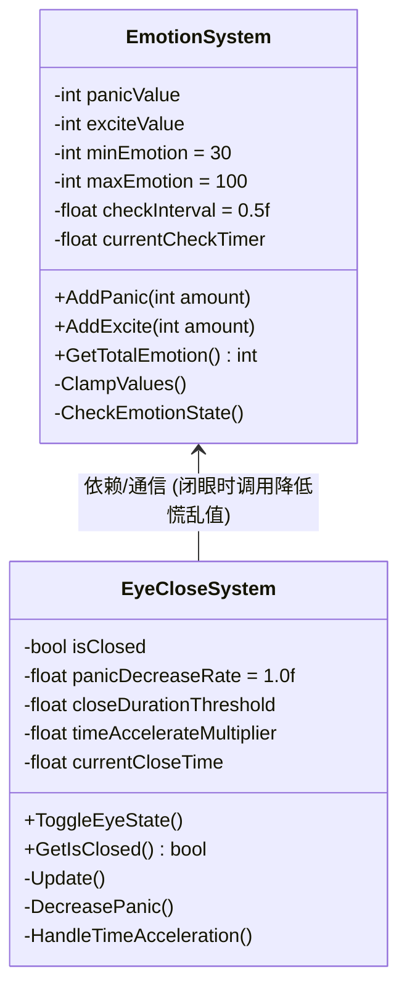

```mermaid
classDiagram
    class EmotionSystem {
        %% 核心数值属性
        -int panicValue
        -int exciteValue
        -int minEmotion = 30
        -int maxEmotion = 100
        
        %% 计时器属性
        -float checkInterval = 0.5f
        -float currentCheckTimer
        
        %% 公共接口方法
        +AddPanic(int amount)
        +AddExcite(int amount)
        +GetTotalEmotion() int
        
        %% 内部处理方法
        -ClampValues()
        -CheckEmotionState()
    }

    class EyeCloseSystem {
        %% 核心状态属性
        -bool isClosed
        
        %% 闭眼数值配置属性
        -float panicDecreaseRate = 1.0f
        -float closeDurationThreshold
        -float timeAccelerateMultiplier
        
        %% 计时器属性
        -float currentCloseTime
        
        %% 公共接口方法
        +ToggleEyeState()
        +GetIsClosed() bool
        
        %% 内部处理方法
        -Update()
        -DecreasePanic()
        -HandleTimeAcceleration()
    }

    %% 关系连线
    EmotionSystem <-- EyeCloseSystem : 依赖/通信 (闭眼时调用降低慌乱值)
```