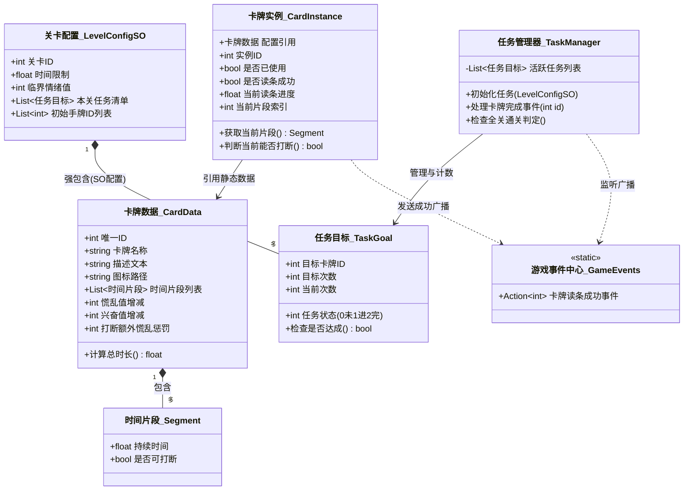
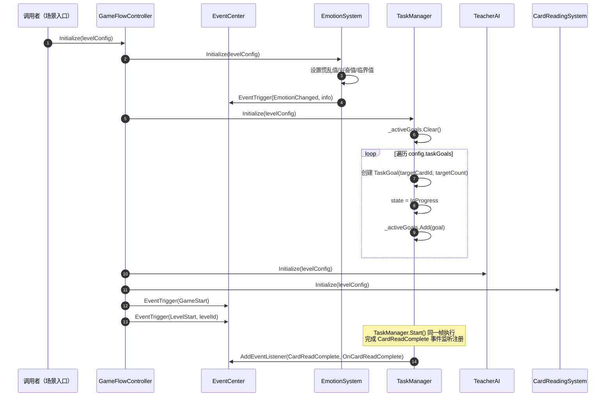
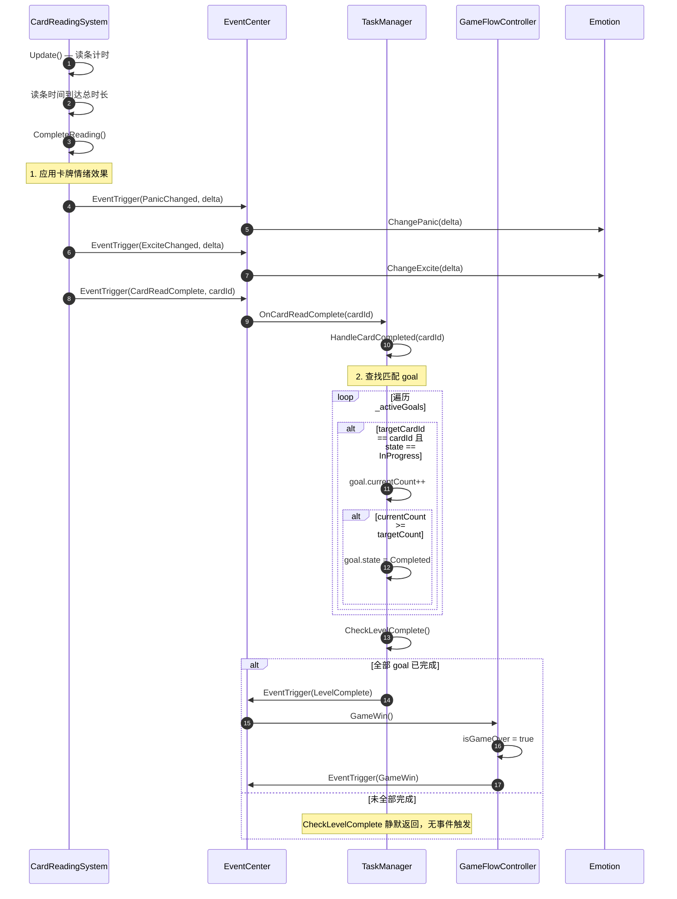
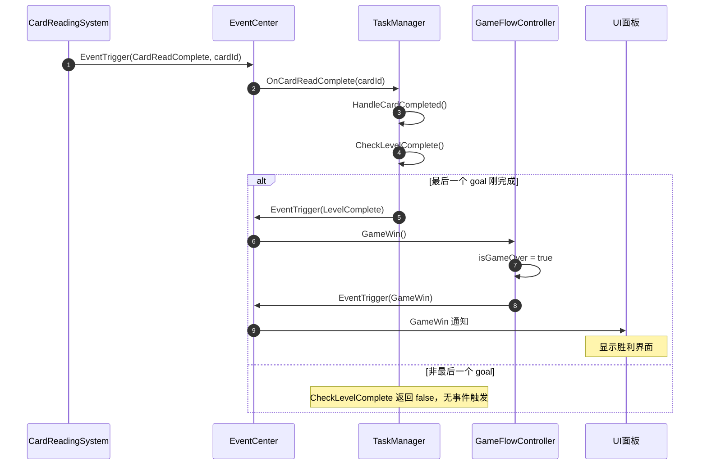
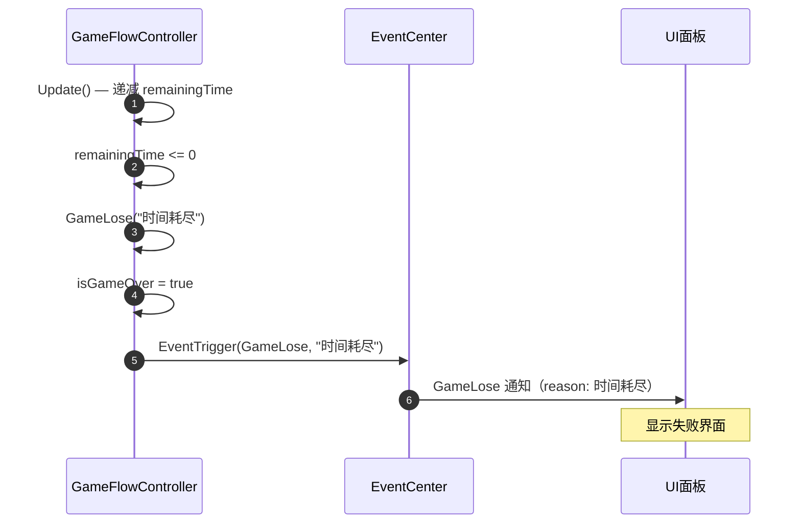
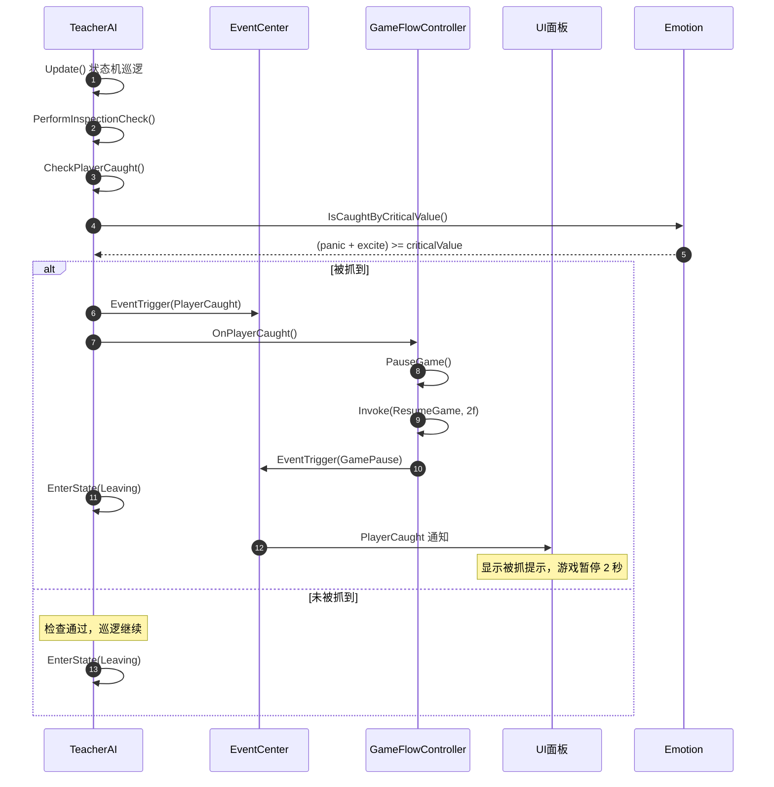
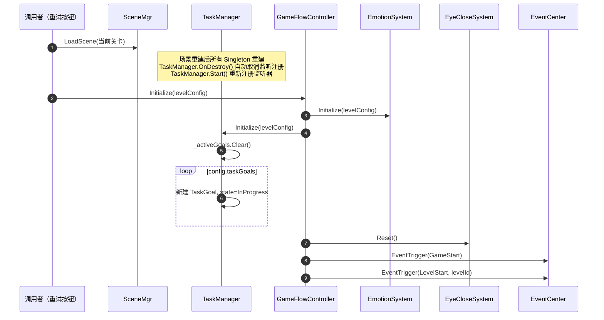

# 任务系统类图



# 任务系统时序图（前端接入参考）

## 1. 初始化流程



**说明**：`TaskManager.Initialize` 建议在 `GameFlowController.Initialize` 之后调用，确保监听器在首次 `CardReadComplete` 触发前已完成注册。

---

## 2. 卡牌完成上报流程



> ⚠️ **注意**：`LevelComplete` 事件在通关路径上由 `TaskManager.CheckLevelComplete` 触发一次。GameFlowController 也会在收到通知后触发 `GameWin`。UI 侧订阅事件时应注意去重。

---

## 3. 任务进度同步（现状 + 推荐 API）

```mermaid
sequenceDiagram
    participant UI as UI面板
    participant TaskMgr as TaskManager
    participant EventC as EventCenter

    Note over UI, TaskMgr: 现状：UI 无法主动查询当前任务进度
    UI ->> TaskMgr: （无公开方法）GetActiveGoals()
    Note right of TaskMgr: _activeGoals 是 private 字段<br/>无任何 public Getter

    UI ->> EventC: 替代方案：监听 CardReadComplete(cardId)
    Note over EventC: 已知 cardId，可推算该任务+1<br/>无法获知总目标数和其他 goal 状态

    Note over UI: 推荐补充以下 3 个 API

    rect rgb(240, 255, 240)
        Note over UI: --- 建议补充的 Public API ---

        GetActiveGoals() → IReadOnlyList<TaskGoal><br/>  用途：UI 渲染任务列表

        GetGoalByCardId(cardId) → TaskGoal<br/>  用途：UI 高亮当前进行中的任务

        GetOverallProgress() → (completed, total)<br/>  用途：UI 显示整体进度条
    end
```

> ⚠️ 当前 `TaskManager` 无任何 public Getter，UI 必须通过事件反向推算进度。建议优先补充 `GetActiveGoals()` 等查询接口。

---

## 4. 关卡通关流程



---

## 5. 关卡失败流程

### 路径 A：时间耗尽



### 路径 B：情绪超标（手电筒巡逻检查）



> ⚠️ **关键逻辑**：`EmotionSystem` 本身**不触发** `GameLose`。情绪值超标仅导致 TeacherAI 巡逻时"抓到玩家"并暂停游戏 2 秒，并非直接判负。当前代码中游戏失败仅由时间耗尽触发。

---

## 6. 重开/重试流程



> ⚠️ **注意**：`TaskManager` 无独立 `Reset()` 方法。重开依赖场景重建（重新加载关卡场景），所有 Singleton 实例重建并重新执行 `Initialize()`。若需在同一场景内重开（不切换场景），需在 `GameFlowController.Initialize` 中显式调用 `TaskManager.Initialize` 并确保 `_activeGoals` 被清空重建。