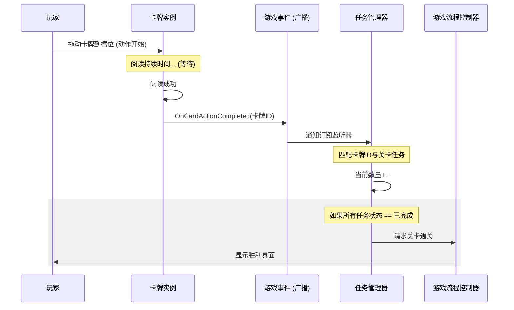
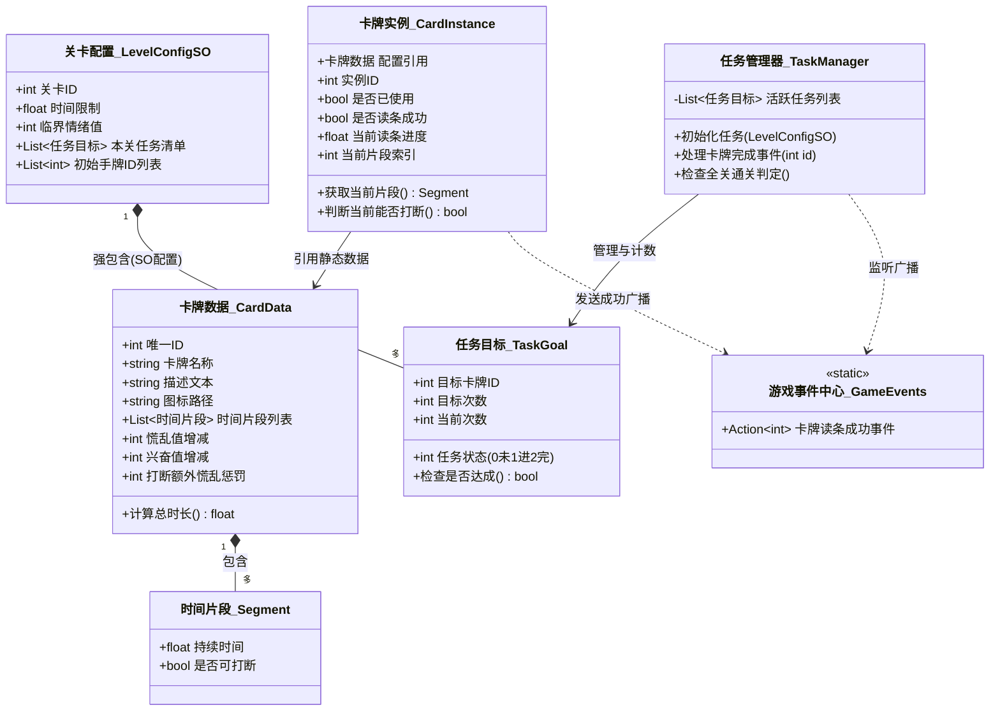

```mermaid
sequenceDiagram
    participant P as 玩家
    participant C as 卡牌实例
    participant E as 游戏事件 (广播)
    participant T as 任务管理器
    participant G as 游戏流程控制器

    P->>C: 拖动卡牌到槽位 (动作开始)
    Note over C: 阅读持续时间... (等待)
    C->>C: 阅读成功
    C->>E: OnCardActionCompleted(卡牌ID)
    E->>T: 通知订阅监听器
    Note over T: 匹配卡牌ID与关卡任务
    T->>T: 当前数量++
    
    rect rgb(240, 240, 240)
        Note over T: 如果所有任务状态 == 已完成
        T->>G: 请求关卡通关
        G->>P: 显示胜利界面
    end
```

```mermaid
classDiagram
    %% 定义卡牌基础配置数据
    class 卡牌数据_CardData {
        +int 唯一ID
        +string 卡牌名称
        +string 描述文本
        +string 图标路径
        +List~时间片段~ 时间片段列表
        +int 慌乱值增减
        +int 兴奋值增减
        +int 打断额外慌乱惩罚
        +计算总时长() float
    }

    %% 定义时间片段结构
    class 时间片段_Segment {
        +float 持续时间
        +bool 是否可打断
    }

    %% 定义运行时的卡牌实例
    class 卡牌实例_CardInstance {
        +卡牌数据 配置引用
        +int 实例ID
        +bool 是否已使用
        +bool 是否读条成功
        +float 当前读条进度
        +int 当前片段索引
        +获取当前片段() Segment
        +判断当前能否打断() bool
    }

    %% 定义任务目标
    class 任务目标_TaskGoal {
        +int 目标卡牌ID
        +int 目标次数
        +int 当前次数
        +int 任务状态(0未1进2完)
        +检查是否达成() bool
    }

    %% 定义关卡配置文件 (ScriptableObject)
    class 关卡配置_LevelConfigSO {
        +int 关卡ID
        +float 时间限制
        +int 临界情绪值
        +List~任务目标~ 本关任务清单
        +List~int~ 初始手牌ID列表
    }

    %% 定义任务管理器
    class 任务管理器_TaskManager {
        -List~任务目标~ 活跃任务列表
        +初始化任务(LevelConfigSO)
        +处理卡牌完成事件(int id)
        +检查全关通关判定()
    }

    %% 定义全局事件中心
    class 游戏事件中心_GameEvents {
        <<static>>
        +Action~int~ 卡牌读条成功事件
    }

    %% 建立类之间的关系
    卡牌数据_CardData "1" *-- "多" 时间片段_Segment : 包含
    卡牌实例_CardInstance --> 卡牌数据_CardData : 引用静态数据
    关卡配置_LevelConfigSO "1" *-- "多" 任务目标_TaskGoal : 强包含(SO配置)
    任务管理器_TaskManager --> 任务目标_TaskGoal : 管理与计数
    任务管理器_TaskManager ..> 游戏事件中心_GameEvents : 监听广播
    卡牌实例_CardInstance ..> 游戏事件中心_GameEvents : 发送成功广播
```